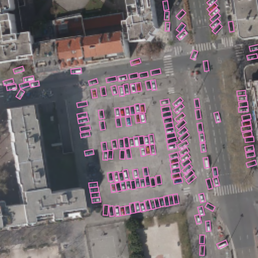
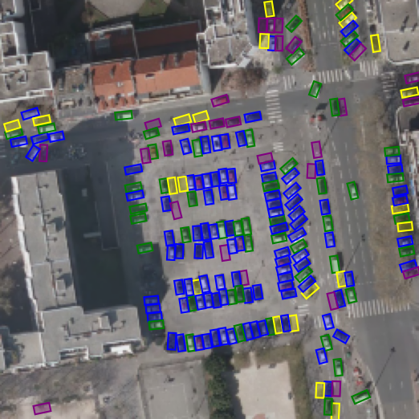
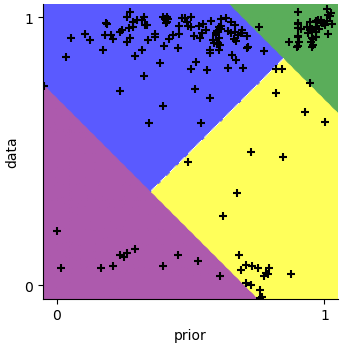

# Combining Convolutional Neural Networks and Point Process for object detection


## Installation

### Conda env
- setup [conda](https://conda.io/projects/conda/en/latest/user-guide/install/index.html) environment with `conda env create -f env.yml`

### Paths setup
- setup models and data paths with [paths_config.yaml](paths_config.yaml).


### DOTA metrics
- to compute metrics install [dota devkit](https://github.com/CAPTAIN-WHU/DOTA_devkit) in `data/` (see installation for more info)
```
cd data/
git clone https://github.com/CAPTAIN-WHU/DOTA_devkit
cd DOTA_devkit/
swig -c++ -python polyiou.i
python setup.py build_ext --inplace
```
- configure `paths_configs.json` as needed
- conda env is provided `env.yml`, setup using `conda env create -f env.yml`


## Results

Results with model [mppe_dota_LMM_0305d](model_configs/mppe/dota/mppe_dota_LMM_0305d.yaml) on sample data from ADS.



Results details, with right plot showing to data and prior scores correspondence to color 


## Repo structure

- [saved_models](saved_models): saved models that can be used for inference (use setup in [paths_config.yaml](paths_config.yaml))
- [env.yml](env.yml): file defining the conda environment suitable to run the code
- [model_configs](model_configs): config files for models


## Usage example

```bash
# training (use -o to overwrite existing model)
python main.py -p train mppe_dota_LMM_305d.yaml
# inferrence and evalution
python main.py -p inferval mppe_dota_LMM_305d
# making some figures
python tools/figures_results.py
```

## External resources
- [Minitel font](https://github.com/Zigazou/Minitel-Canvas) (CC0 license)


